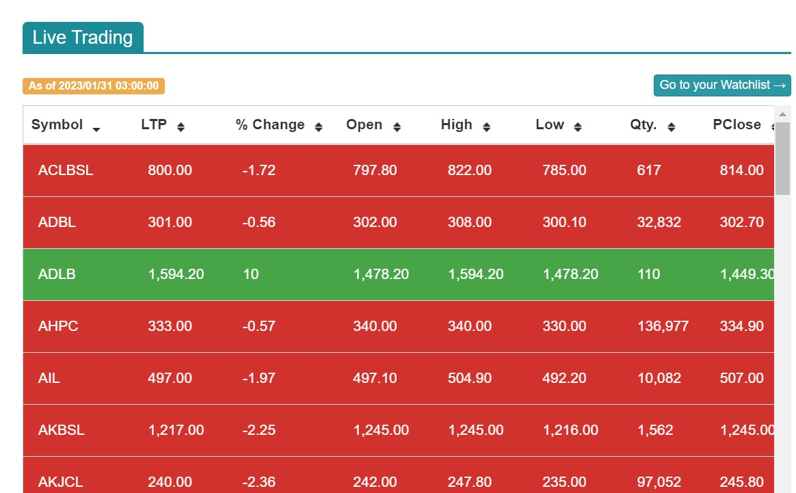
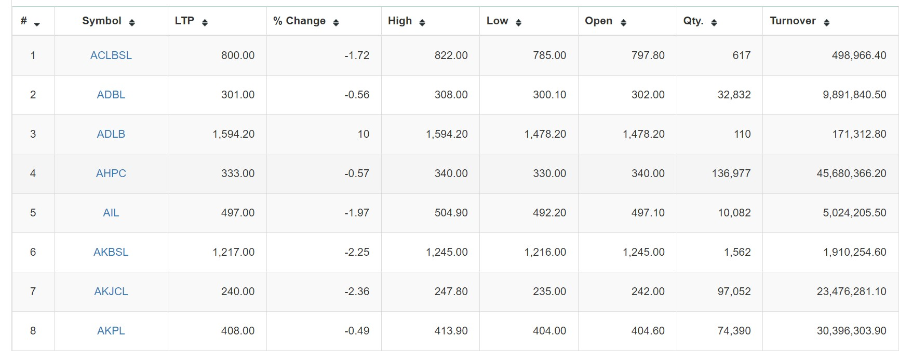
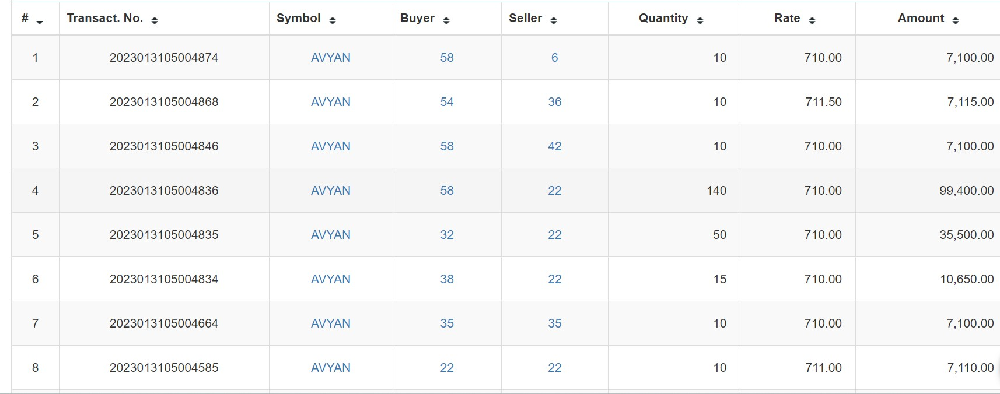
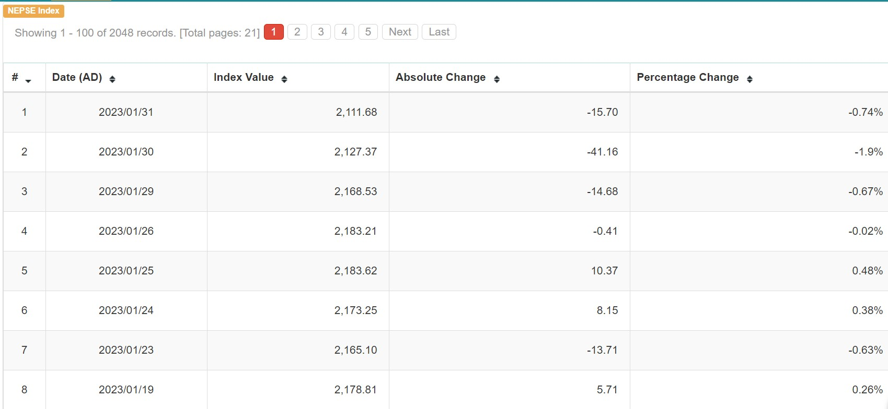
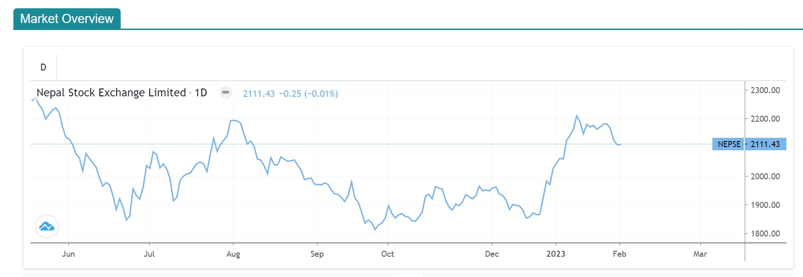

Market
======
.. Note::
    The symbol symbolizes the company. For example:- ADBL-Agriculture Development Bank Limited and LTP means last transaction price.

Live Trading
------------
Here you can see the shareprice of different companies increasing and decreasing. 
The green color means the share price is increasing and the red color means decreasing in the share prices...
If you click in any symbol, you can get detail information about particular company.

Above mention is the image of Live Trading of date 2023/01/31.

Todays Shareprice
-----------------
It gives the information about the recent shareprice of different companies including LTP(Last Transaction Price),
the turnover and percentage of changes.
You can also search the details of any company on a particular day.

Floorsheet
----------

It contain all the transaction details of each company. it also includes transaction id, company's symbol (BHNC-Buddhabhumi Nepal Hydropower Company Limited), buyer, seller, quantity, rate and the total amount.

Indices
-------
It contain overall detail of Indices. For example: If you want to know detail about the overall Hydropower companies. It contain index value, absolute changes and change percentage of each day.

Market Overview
---------------
It contain overall every detail of the market which include market Summary, indices, sub indices, top turnover as well as gainers and loosers.

.. note::
    Gainers are the company which are making profit and whose prices are being high Whereas the loosers are those that are having loss. 
    Turnover means the total amount sales of shares over a period of time.
